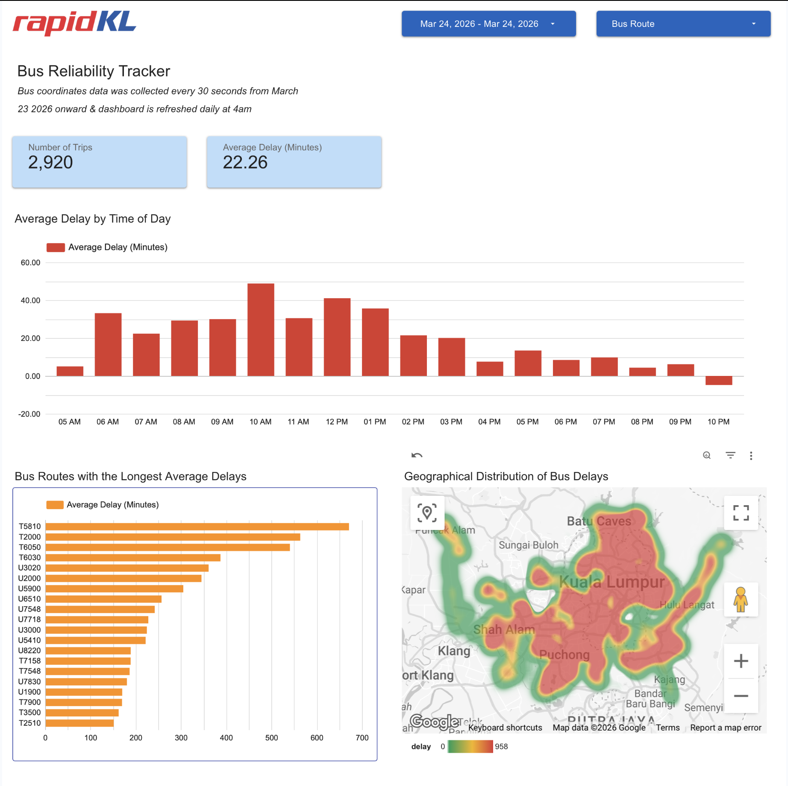
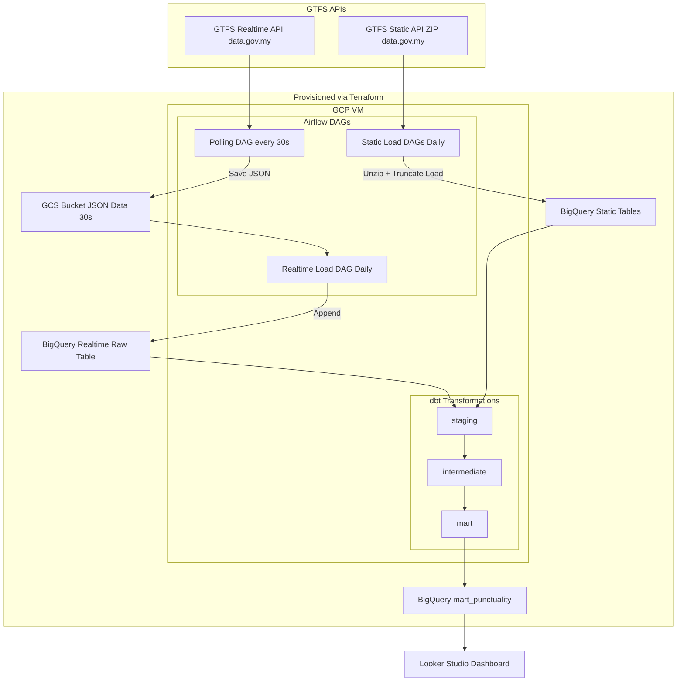
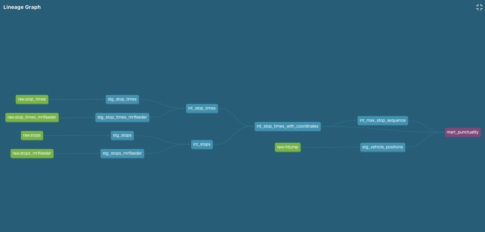
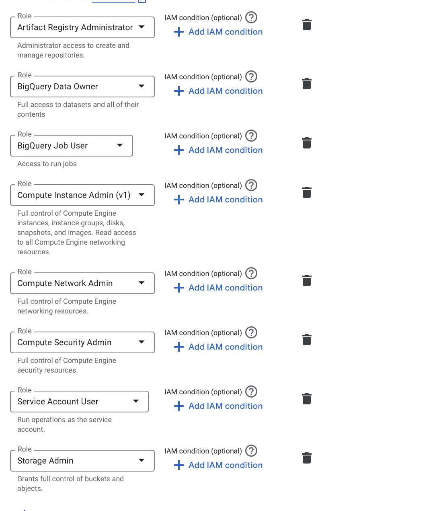
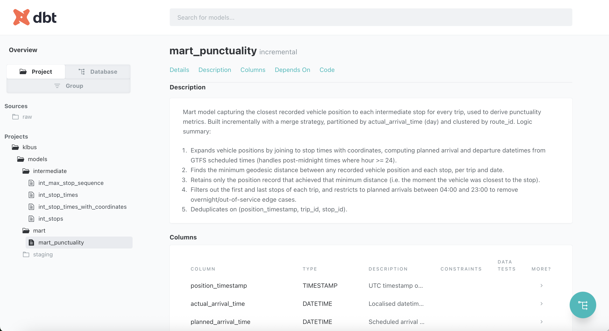

# KL Bus reliability tracker

# Overview

This project ingests bus coordinates data (30 second precision) and bus route & schedule data (updated daily) of Rapid KL buses and MRT feeder buses in Kuala Lumpur. The data is extracted, loaded, and transformed, and then used to produce a punctuality mart and dashboard.

The resulting punctuality dashboard can be filtered by date range and bus route id.

The target audience of this dashboard is the ops team at RapidKL (Malaysia's primary bus service) to analyse patterns in bus lateness, and improve service, as well as to use it for planning & reorganizing routes.

**IMPORTANT NOTE: the bus coordinate data collection started from 23rd March 2026 onwards, so please restrict your date filters to after this date if testing the Looker Studio dashboard. Note that I may tear down the VM where I am running the data ingestion dags sometime this month for cost reasons, but anything between 23 March 2026 and 30 March 2026 should be permanently analyzable in the dashboard**



The reporting dashboard can be found here: https://lookerstudio.google.com/reporting/c4bbf74b-ddae-4187-9ee7-1d25f541bc03

# Data Sources

The two data sources are:
- [GTFS Realtime API Endpoint](https://developer.data.gov.my/realtime-api/gtfs-realtime#gtfs-realtime-api-endpoint)
    - Bus coordinate data that is updated every 30 seconds.
    - Note this is **NOT** actually real-time bus updates, as the bus positions are only updated in the API every 30 seconds. I will use the term realtime in reference to this API, but this is a **batch processing** project.
- [GTFS Static API Endpoint](https://developer.data.gov.my/realtime-api/gtfs-static)

# Architecture

## Stack

- **Orchestrator:** Airflow
- **Lakehouse:** Google Cloud Storage
- **Warehouse** BigQuery
- **Transformation:** dbt
- **Provisioning:** Terraform
- **Dashboard:** Looker Studio

## Data Flow:
- ingests data from [GTFS Realtime API Endpoint](https://developer.data.gov.my/realtime-api/gtfs-realtime#gtfs-realtime-api-endpoint) every 30 seconds, stores the JSONs in Google Cloud Storage
- truncate loads the bus route & bus schedule information daily from the [GTFS Static API Endpoint](https://developer.data.gov.my/realtime-api/gtfs-static) into bigquery tables.
- append loads the JSON data (which has 30-second precision) daily into a BigQuery table.
- transforms the realtime & static data (including joining them) in dbt to produce a punctuality mart
- data from the punctuality mart is visualized in a Looker Studio Dashboard

## Pipeline diagram
 

 
### Airflow DAGs
 
| DAG | Schedule | Description |
|---|---|---|
| Polling DAG | Every 30 s | Hits the GTFS Realtime API for rapid-kl bus and mrtfeeder, saves raw JSON to GCS |
| Realtime Load DAG | Daily | Loads JSON from GCS into `raw.rtdump` in BigQuery, then triggers the dbt run |
| Static Load DAG | Daily | Downloads the static GTFS zip, unzips it, and truncate-loads stop times, stops, trips, etc into BigQuery |
 
### Google Cloud Storage
 
Intermediate store for raw GTFS Realtime JSON snapshots polled every 30 seconds. Files are loaded into BigQuery in bulk by the daily Realtime Load DAG.
 
### dbt models
 
| Layer | Model | Description |
|---|---|---|
| Staging | `stg_vehicle_positions` | Cleans and casts datatypes of realtime vehicle position data from `raw.rtdump` |
| Staging | `stg_stop_times` | Stages bus stop time data |
| Staging | `stg_stop_times_mrtfeeder` | Stages MRT feeder stop time data |
| Staging | `stg_stops` | Stages bus stop reference data |
| Staging | `stg_stops_mrtfeeder` | Stages MRT feeder stop reference data |
| Intermediate | `int_stop_times` | Unions bus and mrtfeeder stop times |
| Intermediate | `int_stops` | Unions bus and mrtfeeder stops |
| Intermediate | `int_stop_times_with_coordinates` | Joins stop times with stop coordinates |
| Intermediate | `int_max_stop_sequence` | Derives the last stop sequence per trip from realtime data |
| Mart | `mart_punctuality` | Final punctuality metrics joining realtime and static schedule data |

Here is the lineage diagram auto-generated by dbt:




### BigQuery table partitioning & clustering
Note that for the purposes of query time optimization, the mart_punctuality table was partitioned by  `actual_arrival_time` (datetime) and clustered by `route_id` (categorical). The reason for this is that in the Looker Studio dashboard, we allow viewers to filter by dates, and route_id.

### Reporting Dashboard - Looker Studio

**Looker Studio** connects directly to BigQuery mart tables. Allows user to filter by date range and route_id. Produces five reports:
- Number of Trips (scorecard)
- Average Delay (Minutes) (scorecard)
- Average Delay by Time of Day (Bar Chart)
- Bus Routes with the Longest Average Delays (Bar Chart)
- Geographical Distribution of Bus Delays (Geographical Heatmap)

## Known limitations
1. Since the GTFS realtime API does not track arrival time at each stop, I estimate "arrival time" at each stop by checking the point at which the bus' coordinates are a minimum distance from each top given a trip_id on a given date. Therefore
  - implication 1: there is some room for error.
  - implication 2: i am limiting the hours of analysis starting at 5am till before 11pm, as late night rides that go on over night may result in incorrect estimations of what time the "nearest" point to each stop occurs. For example, if a ride starts at 11pm (day 1), and is scheduled to end at 12:15am (day 2), the minimum distance may erroneously be logged on day 2's post 11pm timing if the ride runs a little early, thereby erroneously offsetting the result by one day. There are other heuristics to work around this (such as incorporating time of arrival into the minimum distance calculation), but for simplicity sake, i've simply restricted the time of analysis to starting at 5am till before 11pm.
  - implication 3: i've excluded the first and last stop of each route from analysis, as they are often the same (circular routes) which complicates the analysis. to keep it simple, i've only included all the intermediate stops in the punctuality metrics.

# How to reproduce

## Prerequisite
1. Create a google cloud project
2. Create and enable compute engine API, artifact registry API in your Google Cloud project
3. Create a big query dataset.
4. Create a google cloud storage bucket.
5. Create a service account with the following permissions, and generate key (with json keyfile) for that service account:
    
6. Clone the github repository
```
git clone https://github.com/nicolenair/kl-bus-reliability-tracker
```

## How to provision (Terraform)

### setup environment variables
Setup a .env file in `kl-bus-reliability-tracker/terraform` folder, according to the following format

```
export GOOGLE_APPLICATION_CREDENTIALS=<path to your service account json file>
export TF_VAR_vm_ssh_pub_key_path=<create an ssh key and point to the path here. see instructions: https://docs.cloud.google.com/compute/docs/connect/create-ssh-keys>
export TF_VAR_vm_ssh_user=<specify desired ssh user>
export TF_VAR_allowed_ssh_ip=<set this to your own ip address + "/32", get ip by running `curl ifconfig.me`>
export TF_VAR_GOOGLE_CLOUD_PROJECT_ID=<your google cloud project id>
export TF_VAR_service_account_email=<your service account email - get from json file>
export TF_VAR_gcs_bucket_name=<your google cloud bucket name>
export TF_VAR_bq_dataset_name=<your bigquery dataset name>
```

### to provision:

```
cd kl-bus-reliability-tracker/terraform
terraform init        # download providers, set up backend — run once per project or after provider changes
terraform plan
terraform apply
```

### to destroy:

```
terraform destroy
```


## How to deploy airflow DAGS & dbt models that handle extraction, loading & transformation

**NOTE: the instructions state how to do this in a GCP VM, but you could run it locally if you preferred to**

1. ssh into vm (should have been provisioned by terraform) from local

```
gcloud compute ssh --project=<your gcp project> --zone=us-central1-a airflow-dbt-vm -- -L 8080:localhost:8080
```

then in the vm, clone the github repo
```
git clone https://github.com/nicolenair/kl-bus-reliability-tracker
```

2. Create .dbt folder & configure .dbt/profiles.yml
```
klbus:
  outputs:
    dev:
      dataset: <your bq dataset>
      job_execution_timeout_seconds: 300
      job_retries: 1
      keyfile: /kl-bus-reliability-tracker-25984de72887.json
      location: US
      method: service-account
      priority: interactive
      project: <your bq project>
      threads: 1
      type: bigquery
  target: dev
```
3. Copy contents of your service account json to `security/<your file>`

4. fill in .env file
```
cd kl-bus-reliability-tracker/airflow-dbt
echo -e "AIRFLOW_UID=$(id -u)" > .env
```

Complete the rest of kl-bus-reliability-tracker/airflow-dbt/.env file based on .env.template
```
AIRFLOW_UID=<should already be filled in>
GCP_PROJECT_ID=
GC_BUCKET_NAME=
GC_DATASET=
CONN_ID=
ENV_FILE=
DBT_PROJECT_DIR=
DBT_PROFILES_DIR=
DBT_KEYFILE_PATH=<pass the path to the service account json>
```

5. set up docker images & start airflow
```
gcloud auth configure-docker us-central1-docker.pkg.dev
sudo usermod -aG docker $USER
newgrp docker
docker build -t airflow-dbt:latest .
cd dbt_project && docker build -t dbt-custom:latest .
cd ../ && docker-compose down && docker-compose up -d
```

6. setup google cloud connection in airflow

- open up airflow at localhost:8080, then go to Admin > Connections and click "add connection". 
- under extra fields > keyfile JSON, paste in the contents of your service account JSON.


7. turn on dags in airflow UI (localhost:8080)
- turn on realtime_poll dag, static_load dag, and static_load_feeder dag
- run static_load and static_load_feeder have run at least once, as the tables must be initially populated/created before realtime_load_daily_table can run.

8. once the dags are running, the mart_punctuality table that is used in the Looker Studio dashboard will start to populate, and you can start to visualize the data using the preferred charts. documented below are the details of the charts used in the dashboard:

- Number of Trips
    - chart type: scorecard
    - aggregation: count distinct
    - field: trip_id
- Average Delay (Minutes)
    - chart type: scorecard
    - aggregation: average
    - field: datetime_diff(actual_arrival_time, planned_arrival_time, MINUTE)
- Average Delay by Time of Day
    - chart type: Bar Chart
    - x-axis: FORMAT_DATETIME("%I %p", planned_arrival_time)
    - y-axis: datetime_diff(actual_arrival_time, planned_arrival_time, MINUTE)
- Bus Routes with the Longest Average Delays
    - chart type: Bar Chart
    - x-axis: datetime_diff(actual_arrival_time, planned_arrival_time, MINUTE)
    - y-axis: route_id
- Geographical Distribution of Bus Delays
    - chart type: google maps (heatmap)
    - location: CONCAT(stop_lat, ',', stop_lon)
    - weight: datetime_diff(actual_arrival_time, planned_arrival_time, MINUTE) 
    

## NOTE: DBT docs
If you want to take a look at the generated docs for the project, you can run the following in the dbt container locally or on the VM. 
- If you run it on the VM be sure to map the relevant port to your local when you ssh so that you can view it in your browser.

```
cd airflow-dbt/dbt_project && docker build -t dbt-custom:latest .

cd ../ && docker run -p 8081:8081 -it  -v ${PWD}/dbt_project:/dbt_project -v /Users/nicolenair/.dbt:/root/.dbt -v <your security json path>:/kl-bus-reliability-tracker-25984de72887.json --env-file .env dbt-custom

dbt docs generate --project-dir /dbt_project/klbus --profiles-dir /root/.dbt && dbt docs serve --project-dir /dbt_project/klbus --profiles-dir /root/.dbt --host 0.0.0.0 --port 8081
```

