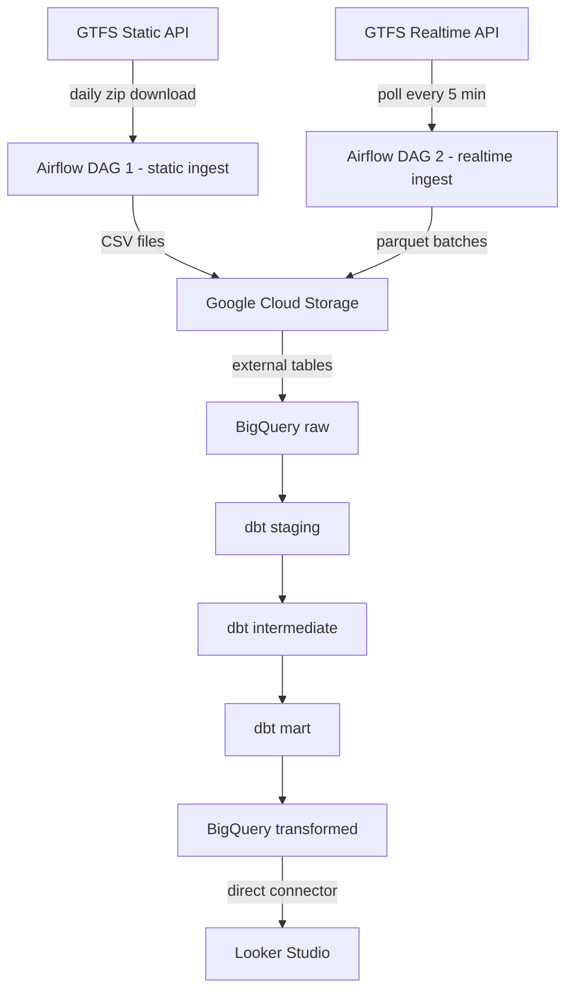

# KL bus reliability tracker - architecture

## Stack

- **Ingestion:** Python poller + Airflow
- **Storage:** Google Cloud Storage + BigQuery
- **Transformation:** dbt
- **Provisioning:** Terraform
- **Dashboard:** Looker Studio

## Data flow



## Reports

| Report | Metric | Requirement | Data sources | Transform complexity |
|---|---|---|---|---|
| 1 - Stop-level punctuality | Avg minutes late at stops by hour | Temporal distribution | realtime positions + stop_times.txt | Hard - spatial + temporal join |
| 2 - Ghost bus detection | Ghost vs completed trips by route | Categorical distribution | trips.txt + calendar.txt + realtime feed | Simple - presence check on trip_id |

## Layer descriptions

**Google Cloud Storage** - raw landing zone. Static GTFS files land as CSVs, realtime snapshots land as parquet batched in 5-minute windows. Partitioned by date.

**BigQuery raw** - external tables pointing at GCS. No transformation, no data movement.

**dbt staging** - rename columns to snake_case, cast types, filter out the ~2% of rapid-bus-kl trips flagged as problematic in the API docs.

**dbt intermediate** - two models:
- `int_stop_punctuality`: for each vehicle, find the first timestamp within 100m of each stop (from realtime position snapshots joined to stops.txt coordinates), then compare against scheduled arrival in stop_times.txt by trip_id and stop_sequence
- `int_ghost_trips`: left join scheduled trip_ids (trips.txt filtered by calendar.txt) against trip_ids seen in the realtime feed during each trip's scheduled window

**dbt mart** - pre-aggregated tables optimised for Looker Studio, partitioned by date and clustered by route.

**Looker Studio** - connects directly to BigQuery mart tables. Global period filter (today / this week / this month) drives both reports simultaneously.

## Known limitations

- Realtime historical data only available from poller start date. Prior period uses synthetic data generated from the static schedule with injected noise.
- ~2% of rapid-bus-kl trips removed from stop_times.txt by the API provider due to data quality issues. Filtered at the staging layer.
- GTFS realtime feed provides vehicle positions only - trip updates and service alerts not yet available for this operator.
- Stop-level punctuality relies on spatial proximity matching which may introduce noise due to occasional erroneous GPS readings flagged in the API docs.


# How to reproduce

## Prerequisite
1. Create a google cloud project
2. Create and enable compute engine API, artifact registry API in your Google Cloud project
3. Create a big query dataset.
4. Create a google cloud storage bucket.
5. Create a service account with the following permissions, and generate key (with json keyfile) for that service account:
    
6. Clone the github repository
```
git clone https://github.com/nicolenair/kl-bus-reliability-tracker
```

## How to provision (Terraform)

### setup environment variables
Setup a .env file in `kl-bus-reliability-tracker/terraform` folder, according to the following format

```
export GOOGLE_APPLICATION_CREDENTIALS=<path to your service account json file>
export TF_VAR_vm_ssh_pub_key_path=<create an ssh key and point to the path here. see instructions: https://docs.cloud.google.com/compute/docs/connect/create-ssh-keys>
export TF_VAR_vm_ssh_user=<specify desired ssh user>
export TF_VAR_allowed_ssh_ip=<set this to your own ip address + "/32", get ip by running `curl ifconfig.me`>
export TF_VAR_GOOGLE_CLOUD_PROJECT_ID=<your google cloud project id>
export TF_VAR_service_account_email=<your service account email - get from json file>
export TF_VAR_gcs_bucket_name=<your google cloud bucket name>
export TF_VAR_bq_dataset_name=<your bigquery dataset name>
```

### to provision:

```
cd kl-bus-reliability-tracker/terraform
terraform init        # download providers, set up backend — run once per project or after provider changes
terraform plan
terraform apply
```

### to destroy:

```
terraform destroy
```


## How to deploy airflow DAGS & dbt models that handle extraction, loading & transformation

1. ssh into vm (should have been provisioned by terraform) from local

```
gcloud compute ssh --project=<your gcp project> --zone=us-central1-a airflow-dbt-vm -- -L 8080:localhost:8080
```

then clone the github repo
```
git clone https://github.com/nicolenair/kl-bus-reliability-tracker
```

2. fill in .env file
```
cd kl-bus-reliability-tracker/airflow-dbt
echo -e "AIRFLOW_UID=$(id -u)" > .env
```

Complete the rest of kl-bus-reliability-tracker/airflow-dbt/.env file based on .env.template
```
AIRFLOW_UID=<should already be filled in>
GCP_PROJECT_ID=
GC_BUCKET_NAME=
GC_DATASET=
CONN_ID=
ENV_FILE=
DBT_PROJECT_DIR=
DBT_PROFILES_DIR=
DBT_KEYFILE_PATH=
```

3. set up docker images & start airflow
```
gcloud auth configure-docker us-central1-docker.pkg.dev
sudo usermod -aG docker $USER
newgrp docker
docker build -t airflow-dbt:latest .
cd dbt_project && docker build -t dbt-custom:latest .
cd ../ && docker-compose down && docker-compose up -d
```

4. setup google cloud connection in airflow

- open up airflow at localhost:8080, then go to Admin > Connections and click "add connection". 
- under extra fields > keyfile JSON, paste in the contents of your service account JSON.


5. turn on dags in airflow UI (localhost:8080)
- turn on realtime_poll dag, static_load dag, and static_load_feeder dag
- once static_load and static_load_feeder have run at least once, turn on realtime_load_daily_table dag

6. once the dags are running, the mart_punctuality table that is used in the Looker Studio dashboard will start to populate, and you can start to visualize the data using the preferred charts. documented below are the details of the charts used in the dashboard:

- Average Delay by Time of Day
    - Bar Chart
    - x-axis: 
