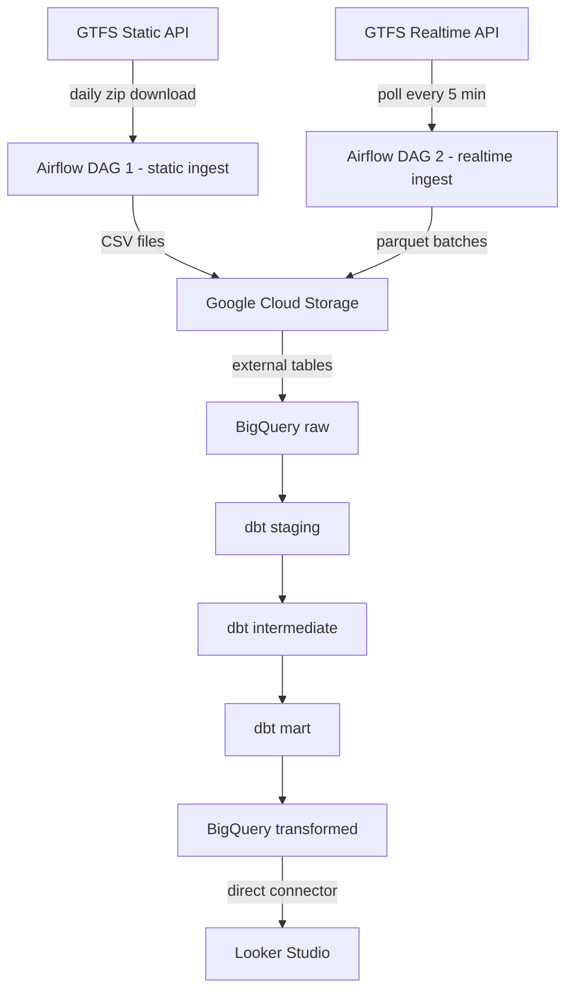

# KL bus reliability tracker - architecture

## Stack

- **Ingestion:** Python poller + Airflow
- **Storage:** Google Cloud Storage + BigQuery
- **Transformation:** dbt
- **Provisioning:** Terraform
- **Dashboard:** Looker Studio

## Data flow

## Reports

| Report | Metric | Requirement | Data sources | Transform complexity |
|---|---|---|---|---|
| 1 - Stop-level punctuality | Avg minutes late at stops by hour | Temporal distribution | realtime positions + stop_times.txt | Hard - spatial + temporal join |
| 2 - Ghost bus detection | Ghost vs completed trips by route | Categorical distribution | trips.txt + calendar.txt + realtime feed | Simple - presence check on trip_id |

## Layer descriptions

**Google Cloud Storage** - raw landing zone. Static GTFS files land as CSVs, realtime snapshots land as parquet batched in 5-minute windows. Partitioned by date.

**BigQuery raw** - external tables pointing at GCS. No transformation, no data movement.

**dbt staging** - rename columns to snake_case, cast types, filter out the ~2% of rapid-bus-kl trips flagged as problematic in the API docs.

**dbt intermediate** - two models:
- `int_stop_punctuality`: for each vehicle, find the first timestamp within 100m of each stop (from realtime position snapshots joined to stops.txt coordinates), then compare against scheduled arrival in stop_times.txt by trip_id and stop_sequence
- `int_ghost_trips`: left join scheduled trip_ids (trips.txt filtered by calendar.txt) against trip_ids seen in the realtime feed during each trip's scheduled window

**dbt mart** - pre-aggregated tables optimised for Looker Studio, partitioned by date and clustered by route.

**Looker Studio** - connects directly to BigQuery mart tables. Global period filter (today / this week / this month) drives both reports simultaneously.

## Known limitations

- Realtime historical data only available from poller start date. Prior period uses synthetic data generated from the static schedule with injected noise.
- ~2% of rapid-bus-kl trips removed from stop_times.txt by the API provider due to data quality issues. Filtered at the staging layer.
- GTFS realtime feed provides vehicle positions only - trip updates and service alerts not yet available for this operator.
- Stop-level punctuality relies on spatial proximity matching which may introduce noise due to occasional erroneous GPS readings flagged in the API docs.