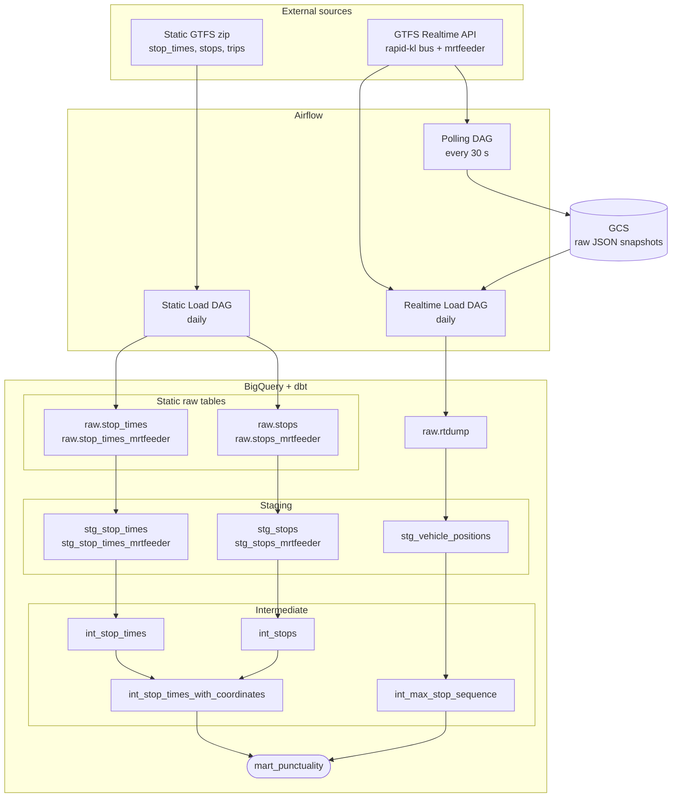

# KL Bus reliability tracker

# Overview

This project tracks punctuality of Rapid KL buses and MRT feeder buses in Kuala Lumpur. It ingests GTFS Realtime data every 30 seconds, stores it in Google Cloud Storage, loads it daily into BigQuery, and transforms it with dbt to produce a punctuality mart.

**IMPORTANT NOTE: the bus coordinate data collection was from 23rd March 2026 to 30th March 2026, so please restrict your date filters to these dates if testing the Looker Studio dashboard**


The reporting dashboard can be found here: https://lookerstudio.google.com/reporting/c4bbf74b-ddae-4187-9ee7-1d25f541bc03

# Architecture

## Stack

- **Orchestrator:** Airflow
- **Lakehouse:** Google Cloud Storage
- **Warehouse** BigQuery
- **Transformation:** dbt
- **Provisioning:** Terraform
- **Dashboard:** Looker Studio

## Pipeline diagram
 

 
### Airflow DAGs
 
| DAG | Schedule | Description |
|---|---|---|
| Polling DAG | Every 30 s | Hits the GTFS Realtime API for rapid-kl bus and mrtfeeder, saves raw JSON to GCS |
| Realtime Load DAG | Daily | Loads JSON from GCS into `raw.rtdump` in BigQuery, then triggers the dbt run |
| Static Load DAG | Daily | Downloads the static GTFS zip, unzips it, and truncate-loads stop times, stops, and trips into BigQuery |
 
### Google Cloud Storage
 
Intermediate store for raw GTFS Realtime JSON snapshots polled every 30 seconds. Files are loaded into BigQuery in bulk by the daily Realtime Load DAG.
 
### dbt models
 
| Layer | Model | Description |
|---|---|---|
| Staging | `stg_vehicle_positions` | Cleans realtime vehicle position data from `raw.rtdump` |
| Staging | `stg_stop_times` | Cleans bus stop time data |
| Staging | `stg_stop_times_mrtfeeder` | Cleans MRT feeder stop time data |
| Staging | `stg_stops` | Cleans bus stop reference data |
| Staging | `stg_stops_mrtfeeder` | Cleans MRT feeder stop reference data |
| Intermediate | `int_stop_times` | Unions bus and mrtfeeder stop times |
| Intermediate | `int_stops` | Unions bus and mrtfeeder stops |
| Intermediate | `int_stop_times_with_coordinates` | Joins stop times with stop coordinates |
| Intermediate | `int_max_stop_sequence` | Derives the last stop sequence per trip from realtime data |
| Mart | `mart_punctuality` | Final punctuality metrics joining realtime and static schedule data |


### BigQuery table partitioning & clustering
Note that for the purposes of query time optimization, the mart_punctuality table was partitioned by  `actual_arrival_time` (datetime) and clustered by `route_id` (categorical). The reason for this is that in the Looker Studio, we allow viewers to filter by dates, and route_id.

### Reporting Dashboard - Looker Studio

**Looker Studio** connects directly to BigQuery mart tables. Global period filter (today / this week / this month) drives both reports simultaneously.

## Known limitations

# How to reproduce

## Prerequisite
1. Create a google cloud project
2. Create and enable compute engine API, artifact registry API in your Google Cloud project
3. Create a big query dataset.
4. Create a google cloud storage bucket.
5. Create a service account with the following permissions, and generate key (with json keyfile) for that service account:
    
6. Clone the github repository
```
git clone https://github.com/nicolenair/kl-bus-reliability-tracker
```

## How to provision (Terraform)

### setup environment variables
Setup a .env file in `kl-bus-reliability-tracker/terraform` folder, according to the following format

```
export GOOGLE_APPLICATION_CREDENTIALS=<path to your service account json file>
export TF_VAR_vm_ssh_pub_key_path=<create an ssh key and point to the path here. see instructions: https://docs.cloud.google.com/compute/docs/connect/create-ssh-keys>
export TF_VAR_vm_ssh_user=<specify desired ssh user>
export TF_VAR_allowed_ssh_ip=<set this to your own ip address + "/32", get ip by running `curl ifconfig.me`>
export TF_VAR_GOOGLE_CLOUD_PROJECT_ID=<your google cloud project id>
export TF_VAR_service_account_email=<your service account email - get from json file>
export TF_VAR_gcs_bucket_name=<your google cloud bucket name>
export TF_VAR_bq_dataset_name=<your bigquery dataset name>
```

### to provision:

```
cd kl-bus-reliability-tracker/terraform
terraform init        # download providers, set up backend — run once per project or after provider changes
terraform plan
terraform apply
```

### to destroy:

```
terraform destroy
```


## How to deploy airflow DAGS & dbt models that handle extraction, loading & transformation

1. ssh into vm (should have been provisioned by terraform) from local

```
gcloud compute ssh --project=<your gcp project> --zone=us-central1-a airflow-dbt-vm -- -L 8080:localhost:8080
```

then clone the github repo
```
git clone https://github.com/nicolenair/kl-bus-reliability-tracker
```

2. Configure .dbt/profiles.yml
```
klbus:
  outputs:
    dev:
      dataset: <your bq dataset>
      job_execution_timeout_seconds: 300
      job_retries: 1
      keyfile: /kl-bus-reliability-tracker-25984de72887.json
      location: US
      method: service-account
      priority: interactive
      project: <your bq project>
      threads: 1
      type: bigquery
  target: dev
```
3. Copy contents of your service account json to `security/<your file>`

4. fill in .env file
```
cd kl-bus-reliability-tracker/airflow-dbt
echo -e "AIRFLOW_UID=$(id -u)" > .env
```

Complete the rest of kl-bus-reliability-tracker/airflow-dbt/.env file based on .env.template
```
AIRFLOW_UID=<should already be filled in>
GCP_PROJECT_ID=
GC_BUCKET_NAME=
GC_DATASET=
CONN_ID=
ENV_FILE=
DBT_PROJECT_DIR=
DBT_PROFILES_DIR=
DBT_KEYFILE_PATH=<pass the path to the service account json>
```

5. set up docker images & start airflow
```
gcloud auth configure-docker us-central1-docker.pkg.dev
sudo usermod -aG docker $USER
newgrp docker
docker build -t airflow-dbt:latest .
cd dbt_project && docker build -t dbt-custom:latest .
cd ../ && docker-compose down && docker-compose up -d
```

6. setup google cloud connection in airflow

- open up airflow at localhost:8080, then go to Admin > Connections and click "add connection". 
- under extra fields > keyfile JSON, paste in the contents of your service account JSON.


7. turn on dags in airflow UI (localhost:8080)
- turn on realtime_poll dag, static_load dag, and static_load_feeder dag
- once static_load and static_load_feeder have run at least once, turn on realtime_load_daily_table dag

8. once the dags are running, the mart_punctuality table that is used in the Looker Studio dashboard will start to populate, and you can start to visualize the data using the preferred charts. documented below are the details of the charts used in the dashboard:

- Number of Trips
    - chart type: scorecard
    - aggregation: count distinct
    - field: trip_id
- Average Delay (Minutes)
    - chart type: scorecard
    - aggregation: average
    - field: datetime_diff(actual_arrival_time, planned_arrival_time, MINUTE)
- Average Delay by Time of Day
    - chart type: Bar Chart
    - x-axis: FORMAT_DATETIME("%I %p", planned_arrival_time)
    - y-axis: datetime_diff(actual_arrival_time, planned_arrival_time, MINUTE)
- Bus Routes with the Longest Average Delays
    - chart type: Bar Chart
    - x-axis: datetime_diff(actual_arrival_time, planned_arrival_time, MINUTE)
    - y-axis: route_id
- Geographical Distribution of Bus Delays
    - chart type: google maps (heatmap)
    - location: CONCAT(stop_lat, ',', stop_lon)
    - weight: datetime_diff(actual_arrival_time, planned_arrival_time, MINUTE) 
    

## NOTE: DBT docs
If you want to take a look at the generated docs for the project, you can run the following in the dbt container locally or on the VM. If you run it on the VM be sure to map the relevant port to your local when you ssh so that you can view it in your browser.

```
cd airflow-dbt/dbt_project && docker build -t dbt-custom:latest .

cd ../ && docker run -p 8081:8081 -it  -v ${PWD}/dbt_project:/dbt_project -v /Users/nicolenair/.dbt:/root/.dbt -v /Users/nicolenair/Projects/de-outer/security/kl-bus-reliability-tracker-25984de72887.json:/kl-bus-reliability-tracker-25984de72887.json --env-file .env dbt-custom

dbt docs generate --project-dir /dbt_project/klbus --profiles-dir /root/.dbt && dbt docs serve --project-dir /dbt_project/klbus --profiles-dir /root/.dbt --host 0.0.0.0 --port 8081
```