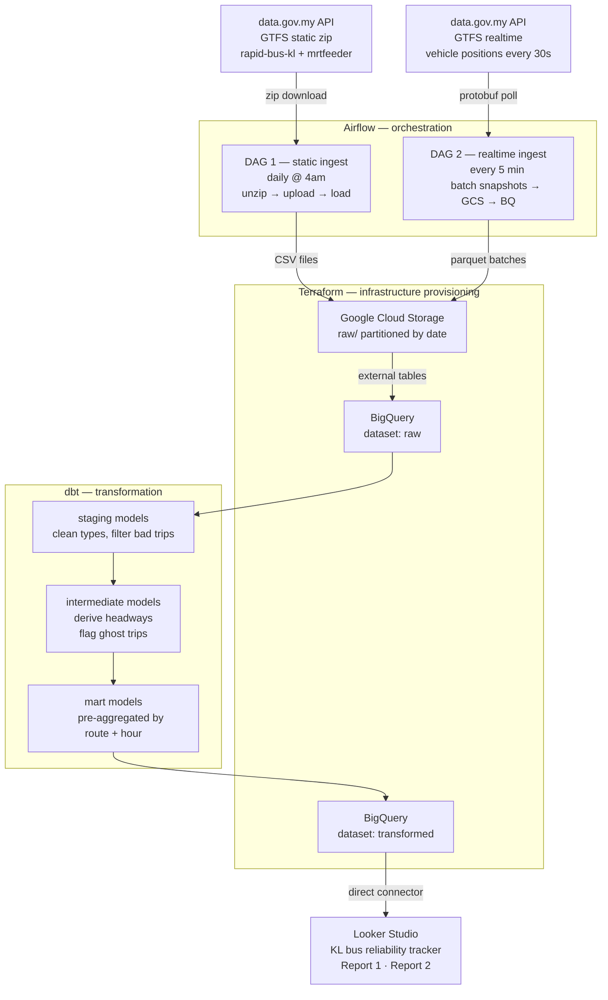

# KL bus reliability tracker — architecture

## Stack
- **Ingestion:** Python poller + Airflow
- **Storage:** Google Cloud Storage (data lake) + BigQuery (data warehouse)
- **Transformation:** dbt
- **Provisioning:** Terraform
- **Dashboard:** Looker Studio

## Data flow

## Layer descriptions

**Google Cloud Storage** — raw landing zone. Static GTFS files land as CSVs, realtime snapshots land as parquet batched in 5-minute windows. Partitioned by date so historical data is queryable without scanning everything.

**BigQuery raw** — external tables pointing at GCS. No transformation, no data movement — just a queryable layer over the raw files.

**dbt staging** — light cleaning only. Rename columns to snake_case, cast types, filter out the ~2% of `rapid-bus-kl` trips flagged as problematic in the API docs.

**dbt intermediate** — the core logic. Join realtime vehicle positions against `stop_times.txt` to derive observed headways. Left join scheduled trips against observed positions to flag ghost trips.

**dbt mart** — pre-aggregated tables optimised for Looker Studio queries. One table per report, partitioned by date and clustered by route.

**Looker Studio** — connects directly to BigQuery mart tables. Global period filter drives both reports simultaneously.

## Known limitations

- Realtime historical data only available from poller start date. Prior period uses synthetic data generated from static schedule with injected noise.
- ~2% of `rapid-bus-kl` trips removed from `stop_times.txt` by the API provider due to data quality issues. These are filtered at the staging layer and noted in dbt model documentation.
- GTFS realtime feed provides vehicle positions only — trip updates and service alerts are not yet available for this operator.
